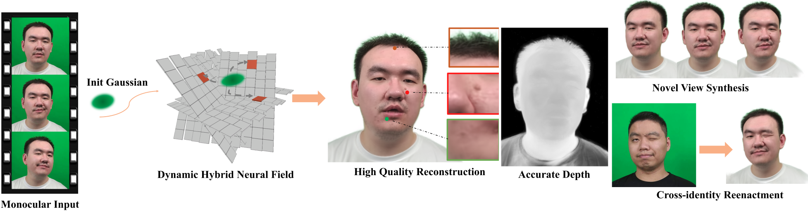

# GaussianHead: Impressive Head Avatars with Learnable Gaussian Diffusion
### | [Complete Version arXiv](http://arxiv.org/abs/2312.01632) | [Project Page]() |


TODO:
>- [x] Uploaded the dataset and pre-trained model weights. (12.19, 2023)
>- [x] Update complete version arXiv paper, if you are interested, please refer to. (12.29, 2023)
>- [x] Release code. (1.3, 2024)
>- [ ] Update project page.


## Getting Started
* Git clone this repo, note using `--recursive` to get submodules;
* Create a conda or python environment and activate. For e.g.,`conda create -n gaussian-head python=3.8`, `source(or conda) activate gaussian-head`;
* [PyTorch](https://pytorch.org/get-started/previous-versions/) >= 2.0.0 is necessary as geoopt requires, for e.g., `pip install torch==2.0.0 torchvision==0.15.1 torchaudio==2.0.1 --index-url https://download.pytorch.org/whl/cu118`;
* install all requirements in `requirements.txt`;
* [geoopt](https://github.com/geoopt/geoopt) is necessary for Riemannian ADAM, refer to it and install in pypi by `pip install geoopt`.

## Riemannian ADAM
Please refer to [here](https://github.com/geoopt/geoopt) to download it, and please consider citing '*Riemannian Adaptive Optimization Methods*' in ICLR2019 if used.

## Preparing Dataset
All our data is sourced from publicly available datasets [NeRFBlendShape](https://drive.google.com/drive/folders/1OiUvo7vHekVpy67Nuxnh3EuJQo7hlSq1?usp=sharing) and make specific modifications. 

Download [our modified datasets](https://drive.google.com/file/d/1vriFnMGsXPVTWRsHQ37SmMNZxU17nICT/view?usp=sharing) for train and render, store it in the following directory.

```
GaussianHead
    ├── data
       ├── id1
           ├── ori_imgs    # rgb frames
           ├── mask    # binary masks
           └── transforms.json    # camera params and expressions
       ├── id2
           ......
```

## Pre-trained Model
Click [here](https://drive.google.com/file/d/13SjlhQ7MOONPUenJHbqwdGJoGeU2Arz6/view?usp=sharing) to download the id1 pre-trained model (training on RTX 2080ti) to quickly view the results, and store the training model according to `./GaussianHead/output/id1`

## Training[Not yet]
Store the training data according to the format and cd to `./GaussianHead`, run:
```
python ./train.py -s ./data/${id} -m ./output/${id} --eval
```

## Rendering
Use your own trained model or the pre-trained model we provide, cd to `./GaussianHead` and run next command, output results will save in `./GaussianHead/output/id1/test`
```
python render.py -m ./output/${id}
```

## Additional Tools
>- Set `--is_debug` used to quickly load a small amount of training data for debug;
>- After training, set `--novel_view`, and then run  `render.py` to get the novel perspective result rotated by the y-axis;
>- Set `--only_head` will only perform head training and rendering. Before this, face_parsing needs to be performed to obtain the segmentation, this can be easily obtained at [NeRFBlendShape](https://drive.google.com/drive/folders/1OiUvo7vHekVpy67Nuxnh3EuJQo7hlSq1?usp=sharing);

## Citation
If anything useful, please cite as:
```
@misc{wang2023gaussianhead,
      title={GaussianHead: Impressive Head Avatars with Learnable Gaussian Diffusion}, 
      author={Jie Wang and Jiu-Cheng Xie and Xianyan Li and Feng Xu and Chi-Man Pun and Hao Gao},
      year={2023},
      eprint={2312.01632},
      archivePrefix={arXiv},
      primaryClass={cs.CV}
}
```
