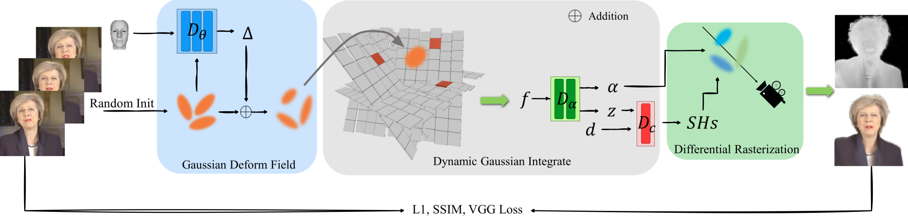

# GaussianHead: Impressive 3D Gaussian-based Head Avatars with Dynamic Hybrid Neural Field
### [Paper]() | [Project Page]() 
Code will arrive after everything is ready...


## Riemannian ADAM
The [geoopt](https://github.com/geoopt/geoopt) library is necessary for the Riemannian ADAM optimizer. Please refer to [here](https://github.com/geoopt/geoopt) to download it, and please consider citing '*Riemannian Adaptive Optimization Methods*' in ICLR2019 if used.

## Preparing dataset
All our data is sourced from publicly available datasets [NeRFBlendShape](https://drive.google.com/drive/folders/1OiUvo7vHekVpy67Nuxnh3EuJQo7hlSq1?usp=sharing). Click here to download our modified [ID1]() data for rendering, and store it in the following directory:

```
GaussianHead
├── Deformable-GaussianHead
    ├── data
       ├── id1
           ├── ori_imgs    # rgb frames
           ├── mask    # binary masks form MODNet
           └── transforms.json    # camera params and expressions
...
```

## Pre-trained model
Click [here]() to download the ID1 pre-trained model to quickly view the results, and store the training model in `./GaussianHead/Deformable-GaussianHead/output/id1`

## Rendering
After downloading the pre-trained model, cd to `./GaussianHead/Deformable-GaussianHead` and run next command, output results will save in `./GaussianHead/Deformable-GaussianHead/output/id1/train`
```
python render.py -m path/to/pre-trained/model
```

## Additional kwargs
>- Set `novel_view` = `True`, and then run  `render.py` to get the new perspective result rotated by the y-axis; 

## Citation
If anything useful, please cite as:
